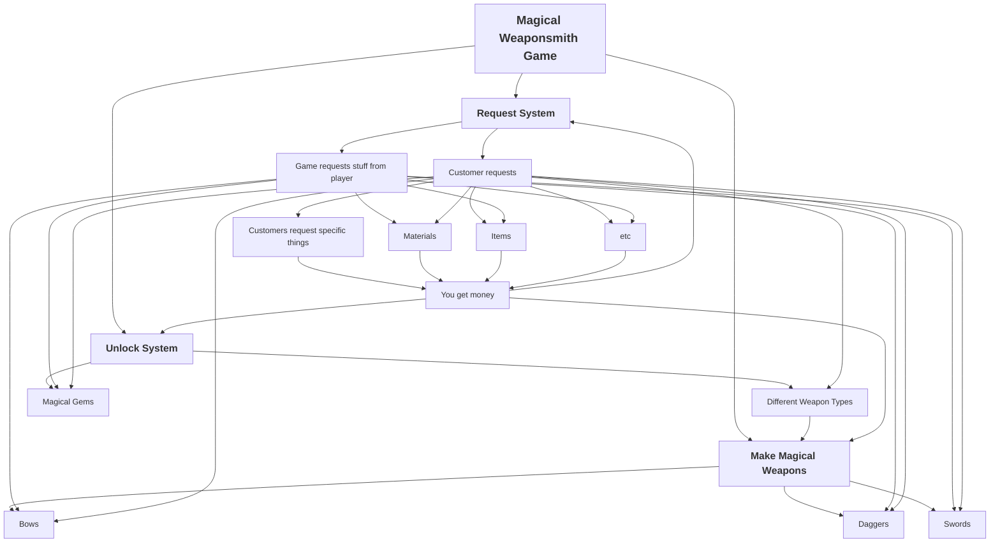

# Plans

## Vision

So basically I want to make a skill-based idle/factory game (2D)

## Theme

Magical weaponsmith

## Features

```mermaid
flowchart TD
    classDef title font-size:24px,font-weight:bold;
    classDef subtitle font-size:20,font-weight:bold;
    A[Magical Weaponsmith Game] --> B[Make Magical Weapons]
    class A title
    class B subtitle

    B --> C[Bows]
    B --> D[Daggers]
    B --> E[Swords]

    A --> F[Unlock System]
    class F subtitle
    F --> G[Different Weapon Types]
    G --> B
    F --> H[Magical Gems]

    A --> I[Request System]
    class I subtitle
    I --> L[Customer requests]
    L --> M[Customers request specific things]
    M --> K

    J --> C
    J --> D
    J --> E

    L --> C
    L --> D
    L --> E

    I --> J[Game requests stuff from player]
    J --> H
    J --> Z[Materials] --> K[You get money]
    L --> Z
    L --> X
    L --> Y
    L --> H
    L --> G
    J --> X[Items] --> K
    J --> Y[etc] --> K

    K --> B
    K --> F
    K --> I
```
